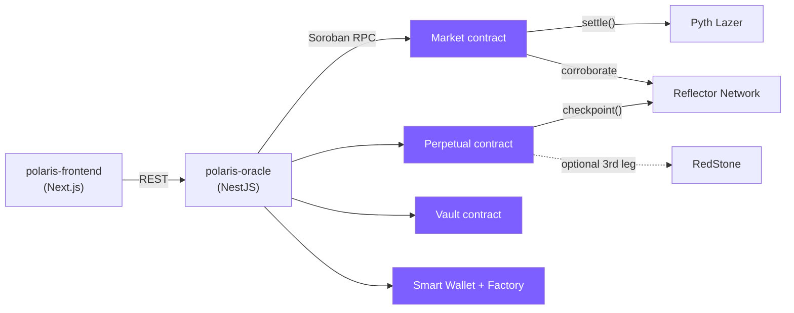

# polaris-contracts

[](https://github.com/only1dreamgene/polaris-contracts/actions/workflows/ci.yml)
[](./LICENSE)
[](https://crates.io/crates/soroban-sdk)

Rust / Soroban smart contracts for **Polaris** — a fully-collateralized,
non-custodial prediction-market system on Stellar. Every position is backed
1:1 by real collateral at every instant; no market can ever owe more than it
holds. Settlement is verified on-chain against a signed Pyth Lazer price
update, cross-checked against a second, genuinely independent oracle
(Reflector Network) before any funds move.

This is one of three repos that make up Polaris:

| Repo | Role |
|---|---|
| **polaris-contracts** (this repo) | The on-chain rules: markets, perpetuals, the LP vault, passkey wallets |
| [polaris-oracle](https://github.com/only1dreamgene/polaris-oracle) | NestJS backend — settlement automation, multi-oracle price relay, sponsored transactions, admin API |
| [polaris-frontend](https://github.com/only1dreamgene/polaris-frontend) | Next.js web app — trading UI, portfolio, embeddable widget, admin dashboard |

## Live on testnet

| Contract | Address |
|---|---|
| Capital-efficiency vault | [`CDDZCX5PT7FURKHTHNKXGNJJNURS4M7BLLNS6BHRV4RJM6CJT25SNCF5`](https://stellar.expert/explorer/testnet/contract/CDDZCX5PT7FURKHTHNKXGNJJNURS4M7BLLNS6BHRV4RJM6CJT25SNCF5) |
| Smart-wallet factory | [`CCLDHPEJBENBV3GRZRHO7RH5OZRTBWP7DWB36L3OCWLKEEAP6FJTTJ5U`](https://stellar.expert/explorer/testnet/contract/CCLDHPEJBENBV3GRZRHO7RH5OZRTBWP7DWB36L3OCWLKEEAP6FJTTJ5U) |
| Mock RedStone (testnet stand-in) | [`CAFAVGX6VUIRPK2KDCK7QGJEOOBM2EWCIA5UJBLOR2T7HZINKVKYRYTI`](https://stellar.expert/explorer/testnet/contract/CAFAVGX6VUIRPK2KDCK7QGJEOOBM2EWCIA5UJBLOR2T7HZINKVKYRYTI) |

Individual market/perpetual contracts are deployed on demand by
`polaris-oracle` (each market is its own contract instance) — the live
backend driving those deploys is at
[polaris-oracle.fly.dev](https://polaris-oracle.fly.dev), and the running
app is at
[polaris-frontend-delta.vercel.app](https://polaris-frontend-delta.vercel.app).

## Contents

- [Contracts at a glance](#contracts-at-a-glance)
- [Why not the original parimutuel design](#why-not-the-original-parimutuel-design)
- [Core mechanism](#core-mechanism)
- [The invariant that matters](#the-invariant-that-matters)
- [Cancellation payout](#cancellation-payout)
- [Pool-depth guard](#pool-depth-guard)
- [Errors, not panics](#errors-not-panics)
- [Cost-driven fee curve](#cost-driven-fee-curve)
- [Passkey smart wallets](#passkey-smart-wallets)
- [The capital-efficiency vault](#the-capital-efficiency-vault)
- [On-chain second-oracle: Reflector Network](#on-chain-second-oracle-reflector-network)
- [A third oracle: RedStone](#a-third-oracle-redstone)
- [The perpetual contract](#the-perpetual-contract)
- [Engineering notes: soroban-sdk gotchas](#engineering-notes-soroban-sdk-gotchas)
- [Building & testing](#building--testing)
- [Deploying](#deploying)

## Architecture



The four highlighted boxes are this repo. Nothing in this workspace talks to
`polaris-oracle` or `polaris-frontend` directly — contracts only know about
each other and the oracle feeds they read.

## Contracts at a glance

Eight crates, one Cargo workspace:

| Crate | Purpose |
|---|---|
| `contracts/market` | The market contract. Source of truth for all funds and rules. `settle` requires a second, genuinely independent oracle (Reflector Network, optionally a third — RedStone) to agree with Pyth Lazer on-chain before finalizing. |
| `contracts/perpetual` | A no-expiry, no-leverage sibling to `contracts/market` — continuous trading with no forced terminal settlement. |
| `contracts/vault` | Capital-efficiency vault — centralizes LP custody and accounting for market seed liquidity, funded once per depositor rather than fragmented per market. |
| `contracts/smart-wallet` | A Soroban custom account contract authorized by a WebAuthn passkey (secp256r1) instead of a keypair. |
| `contracts/smart-wallet-factory` | Deploys + initializes a `smart-wallet` instance in one atomic call, at a deterministic address derived from the passkey's public key. |
| `contracts/ctf-math` | `rlib`-only shared crate (no `#[contract]`) holding the pure CTF/AMM math, the generic SEP-40 oracle client, and the oracle-corroboration logic both `market` and `perpetual` call. |
| `contracts/mock-lazer` | Testnet-only stand-in for the real `pyth-lazer-stellar` verifier. **Never deploy to mainnet.** |
| `contracts/mock-redstone` | Testnet-only stand-in for RedStone's real (mainnet-only) SEP-40 wrapper. **Never deploy to mainnet.** |

## Why not the original parimutuel design

The obvious design for a binary market is parimutuel: everyone stakes into a
shared pool, the losing side's stakes fund the winners, split pro-rata at
settlement. That's simple, but it has two structural weaknesses:

1. **No price discovery before expiry.** A stake is frozen the moment it's
   placed; there's no live "odds" and no way to exit early.
2. **An edge case to special-case.** If literally nobody bet the winning
   side, there's nothing to pay winners with — you need a bespoke "empty
   winning pool → refund everyone" branch.

Polaris instead uses a **fully-collateralized conditional-token market**
(the design behind Gnosis's Conditional Tokens Framework and Polymarket),
with a **constant-product AMM** (Uniswap-style `x*y=k`, not LMSR — LMSR needs
floating-point `exp`/`ln`, which isn't safe to hand-roll in an integer-only
WASM contract) for continuous pricing between the two outcome shares.

## Core mechanism

- **`split(amount)`** locks `amount` collateral, mints `amount` YES-shares
  **and** `amount` NO-shares to the caller. Always 1:1, always fully
  collateralized — this can never be gamed or under-collateralized.
- **`merge(amount)`** is the inverse: burn equal YES+NO, get `amount`
  collateral back. Available any time before resolution.
- **`buy(prediction, collateral_amount)`** = split, then swap the unwanted
  side into more of the wanted side via the AMM. One call, standard "buy
  YES" UX; returns more shares than a plain split because of the swap bonus.
- **`sell(prediction, shares_in)`** sells directly to collateral in one
  call, using a closed-form solve of the constant-product invariant (see
  the doc comment on `cpmm_sell_out` in `contracts/market/src/lib.rs` for
  why a naive "swap to the other side, then merge" silently returns zero
  when a user sells an entire one-sided position — a bug this build's test
  suite catches and asserts against by name).
- **`transfer(from, to, prediction, amount)`** moves a share balance between
  addresses — the tradability primitive. Shares are internal ledger entries
  on the market contract itself, not a separate SEP-41 token contract per
  side.
- **`settle(payload)`** — permissionless once expiry has passed. Verifies
  the Pyth Lazer payload on-chain via `pyth-lazer-stellar-sdk`, reads the
  configured feed, checks the price is timestamped within ±5 minutes of
  expiry, and marks the winning side (`>=` strike → YES, inclusive).
- **`cancel()`** — the liveness backstop. Permissionless once
  `expiry + grace_period` has passed with no settlement. Every holder can
  then redeem — see [Cancellation payout](#cancellation-payout) for why
  it's *not* 1:1 on both sides.
- **`redeem(user)`** — pays out 1:1 collateral per winning share once
  resolved; on cancellation, 0.5 collateral per share held on either side.

## The invariant that matters

Because every share is minted as a matched YES+NO pair against locked
collateral, and every code path that changes a real collateral balance
changes `total_supply` by the exact same amount, this holds after **every
single successful call**, for the whole lifecycle:

```
collateral_token.balance(market_contract) == market.total_supply
```

The market can never be short of collateral to pay whoever's holding the
winning side — there's no "empty winning pool" branch to write or test,
because the invariant makes it structurally impossible. `assert_solvent()`
in the test suite checks this after every test.

## Cancellation payout

`redeem()` on a cancelled market pays **0.5 collateral per share held on
either side** (`(balance_yes + balance_no) / 2`), not 1:1 on both — and
that 0.5 isn't a compromise, it's load-bearing.

`sum(all YES balances) == total_supply` and `sum(all NO balances) ==
total_supply` are both independently true (the same number) — but real
collateral only ever backs *one* `total_supply`'s worth, not two.
`settle()`'s resolved paths get this right by paying only the winning side
and discarding the other. `cancel()` has no winning side, so an earlier
version paid *both* in full — which double-counts against a single pool of
backing collateral.

Caught live, not in review: a single user who did nothing but `split()` a
plain matched pair (no AMM, no `buy`/`sell` involved at all) — cancel,
redeem — got back double what they'd locked. The treasury's own,
completely ordinary redemption of its pool-seeded share then panicked:
`"balance is not sufficient to spend"`. Existing tests only ever redeemed
one holder per test and stopped, so nobody had checked whether the *next*
legitimate holder could still get paid. See
`cancel_redeem_stays_solvent_for_every_holder_including_treasury` in
`contracts/market/src/test.rs`.

Paying each complementary token 0.5 is the standard answer for a voided
market in CTF-style systems generally (Polymarket, Gnosis), for exactly
this reason: it's the only per-holder formula that's *guaranteed* solvent
— summed across every holder, payouts equal `total_supply` exactly,
regardless of trading history — without tracking anything beyond the
balances that already exist.

## Pool-depth guard

`buy`/`sell` reject a trade outright (`Error::PoolDepthExceeded`) if it
would consume half or more of the reserve it's drawing from. This isn't
slippage protection — `min_shares_out`/`min_collateral_out` already cover
that. It's a correctness fix for integer floor division: `cpmm_out`'s
`k / new_reserve_in` can floor hard enough that a large-but-entirely-plausible
trade against a shallow pool claims nearly the *entire* opposite reserve.
Confirmed empirically: a single 10.1 XLM buy against a 10,000-stroop seeded
pool drained it from 10,000 down to 1 before this guard existed (see
`buy_large_enough_to_exhaust_a_reserve_is_rejected` in
`contracts/market/src/test.rs`).

## Errors, not panics

Every entrypoint returns `Result<T, Error>` with a typed `#[contracterror]`
enum (23 variants) rather than trapping. A failed call still reverts the
whole transaction — atomicity isn't lost — but callers get a structured
reason instead of an opaque panic.

## Cost-driven fee curve

The swap fee isn't a flat admin-set constant — it's computed per-trade from
a curve: `effective_fee_bps = min_fee_bps + (base_fee_bps - min_fee_bps) *
initial_liquidity / total_supply`. A fresh market charges `base_fee_bps`;
as `total_supply` grows (more collateral locked via `split`/`buy`), the fee
compresses toward `min_fee_bps` automatically. Query the current value with
`get_fee()` rather than recomputing it elsewhere.

## Passkey smart wallets

Rather than requiring a browser extension (Freighter) for every bettor,
`contracts/smart-wallet` lets a WebAuthn passkey (Face ID / Touch ID /
Windows Hello / a hardware key) act as the signer for a Soroban `Address`
directly, via Soroban's account-abstraction `__check_auth` mechanism.

The verification logic — challenge binding via base64url, the
`sha256(authenticator_data ‖ sha256(client_data_json))` digest construction —
is adapted from [leighmcculloch/soroban-webauthn](https://github.com/leighmcculloch/soroban-webauthn),
the reference pattern the Stellar ecosystem uses for this. That repo
explicitly calls its own code "demo material only... not audited"; the same
applies here. It's grounded in real, independently-verified cryptography
(the test suite generates and self-verifies a genuine secp256r1 keypair and
signature) but this has not had a professional security review and should
not hold real value.

One non-obvious thing the test suite caught empirically: Soroban's
`secp256r1_verify` **rejects high-S signatures**. A signature generated
without normalizing `s` to the curve's lower half verified fine locally
but was rejected by the Soroban host — the frontend's WebAuthn signing code
has to replicate this normalization (`s' = n - s` when `s > n/2`) on every
real browser assertion.

### Portable identity

Because a wallet's address is `deploy()`'s deterministic function of
`sha256(public_key)`, the *same* passkey resolves to the *same* Soroban
address regardless of which frontend calls the factory — `resolve(public_key)`
computes that address without deploying anything, so a caller can check
whether a wallet already exists before prompting a "create wallet" flow.

### Factory wasm pinning — a real, confirmed-exploitable bug that shipped fixed

`smart-wallet-factory`'s `deploy()` used to take `wasm_hash` as a caller-
supplied parameter, with no `require_auth()` either. A deployed wallet's
address is a pure deterministic function of `(this factory, sha256(public_key))`
— the exact formula `resolve()` exposes as a public, permissionless read for
anyone to compute in advance. An attacker who learned a victim's public key
before the *legitimate* deploy transaction landed (e.g. watching it sit in
the network's public mempool) could race a `deploy(victim_pk,
attacker_wasm_hash)` call ahead of it, permanently taking over the address
the whole system believes is the victim's wallet.

Reproduced directly (no real mempool race needed — the vulnerability is
that nothing stopped this at all, for any caller, for any already-uploaded
wasm): see `deploy_always_uses_the_pinned_wasm_never_a_caller_choice` in
`contracts/smart-wallet-factory/src/test.rs`.

Fixed by pinning the wasm hash once, at factory setup
(`initialize(admin, wasm_hash)`, admin-authenticated, one-time) — `deploy`
now takes only `public_key` and always runs the pinned hash. `deploy`
itself stays deliberately unauthenticated: "anyone can pay to deploy
anyone's wallet" is the intended, safe design `polaris-oracle` relies on to
onboard a user who holds zero XLM — that's only ever safe once the code
being deployed can no longer be the caller's choice.

Verified live: deployed a fresh factory instance
(`CCLDHPEJBENBV3GRZRHO7RH5OZRTBWP7DWB36L3OCWLKEEAP6FJTTJ5U`, the address
listed under [Live on testnet](#live-on-testnet) above), initialized it,
and confirmed via the running `polaris-oracle` (a real email-login wallet
deploy) plus a direct on-chain `get_public_key` read that the deployed
wallet's stored key matches exactly what the backend generated.

## The capital-efficiency vault

`contracts/vault` is additive and isolated — **zero changes to
`contracts/market`**. What it fixes: every new market's `initial_liquidity`
used to be wired from the admin's own keypair by hand at `initialize()`
time, and that seed capital sat siloed in that one market's reserves for
its entire life, recovered only at settlement into a bare `treasury` wallet
address with no accounting at all. This is deliberately *not*
"cross-margin" in the derivatives sense (netting risk across positions, a
liquidation engine) — the vault centralizes *custody and accounting* of LP
capital while every individual market stays exactly as fully,
independently collateralized as it already was.

- `deposit(from, amount)` — LP capital in, permissionless.
- `withdraw(admin, to, amount)` — admin-gated capital out. Funds a new
  market's seed liquidity (what `polaris-oracle`'s `MarketFactoryService`
  draws on), or an LP redemption.
- `redeem_from_market(admin, market_id)` — collects the vault's own payout
  from a settled/cancelled market it was `treasury` for.

**v1 is deliberately simple, stated up front**: single-admin-owned capital,
not fractional LP shares. Multiple depositors can `deposit`, but there's no
proportional-withdrawal accounting yet — a real multi-LP product needs
share accounting before this is safe to open past a single trusted
operator ([tracked as an open issue](https://github.com/only1dreamgene/polaris-contracts/issues/2)).

Verified live on testnet, the full loop: deployed the vault above,
deposited 20,000,000 stroops, withdrew 10,000,000 of it to seed a real
market with the vault as `treasury`, settled that market, and called
`redeem_from_market` — a real transaction
(`401ddfea828d7050b367c9a9c8507ff509f0e5d3c6558a772b6bccf9b7d61fd0`,
confirmed `SUCCESS`) that moved exactly 10,000,000 stroops back from the
market to the vault, landing its balance back at the original 20,000,000.

## On-chain second-oracle: Reflector Network

`settle` no longer trusts Pyth Lazer's signed payload alone. It also reads
[Reflector Network](https://reflector.network) — genuinely independent
node operators and data pipeline — on-chain, via a real cross-contract
call, and requires the two to agree within `reflector.tolerance_bps`
before finalizing. This is enforced by the contract, not the backend: a
compromised or buggy `polaris-oracle` process can't bypass it.

Reflector publishes a free, [SEP-40](https://github.com/stellar/stellar-protocol/blob/master/ecosystem/sep-0040.md)-standardized
testnet oracle at `CCYOZJCOPG34LLQQ7N24YXBM7LL62R7ONMZ3G6WZAAYPB5OYKOMJRN63` —
`decimals()` is 14, `resolution()` is 300s (a 5-minute update cadence).

`OracleFeedConfig` (`initialize`'s 12th parameter for the Reflector leg,
required, not optional) bundles the corroborating-oracle settings into one
`contracttype` struct:

```rust
pub struct OracleFeedConfig {
    pub contract: Address,       // which oracle instance to read
    pub asset: Asset,            // Stellar(Address) or Other(Symbol)
    pub max_staleness_secs: u64, // validated at initialize() against the
                                  // oracle's own live resolution()
    pub tolerance_bps: u32,      // default 150 (1.5%)
}
```

**Fails closed, not gracefully-degrades**: `None`/stale/divergent Reflector
data all reject `settle` outright. This doesn't strand funds — the existing
permissionless `cancel` after `expiry + grace_period` is already the
unconditional liveness backstop, so a market that can never get Reflector
agreement cancels and refunds through the exact same well-tested path
every other unresolvable market already uses.

## A third oracle: RedStone

`settle`/`record_price_checkpoint` can optionally corroborate against a
**third**, genuinely independent SEP-40 source — RedStone — on top of
Reflector, closing the gap between "2-of-2" and real multi-provider
redundancy.

- **Unanimous, not majority.** A market configured with a `redstone` leg
  requires *every* configured oracle to agree — any one disagreeing or
  unavailable rejects the call. Deliberate: Polymarket's UMA optimistic
  oracle had an $85M dispute gamed via permissionless quorum voting, and
  UMA's fix was to *restrict* its voter set rather than broaden it. A
  2-of-3 majority would mean an adversary only needs to control the same
  two sources as today's 2-of-2 — unanimous agreement is the only rule
  where a genuinely independent third source actually raises the bar.
- **RedStone's Stellar deployment is mainnet-only** — confirmed live:
  reading RedStone's real mainnet contract
  (`CBMGLKUQZVSAIL5CPDDAWSUY7MAKXISHMOZEVLMBUWBMFGHRJSR4WYRF`) returned a
  genuinely fresh XLM/USD price. No testnet contract exists, so
  `contracts/market`'s `redstone` parameter is `Option<OracleFeedConfig>`
  rather than required. `contracts/perpetual`'s checkpoint feature was
  already opt-in as a whole bundle, so `redstone` is a *required* field of
  `PriceOracleConfig` whenever that bundle is configured at all.
- **`contracts/mock-redstone`** is a bare SEP-40-shaped, admin-poked
  testnet stand-in (deployed at
  [`CAFAVGX6VUIRPK2KDCK7QGJEOOBM2EWCIA5UJBLOR2T7HZINKVKYRYTI`](https://stellar.expert/explorer/testnet/contract/CAFAVGX6VUIRPK2KDCK7QGJEOOBM2EWCIA5UJBLOR2T7HZINKVKYRYTI)),
  wired into `polaris-oracle`'s perpetual deployment alongside the real
  Reflector testnet oracle — this makes `record_price_checkpoint`
  genuinely exercisable end-to-end on testnet, not just unit-tested
  against a mock in isolation.

## The perpetual contract

`contracts/perpetual` started as a request for crypto-perpetual-futures
mechanics — margin, leverage, funding payments against a reference price.
That design was rejected in two stages before any code was written:

1. A paper (arXiv 2605.10400, "Resolution-Aware Perpetual Futures on
   Binary Prediction Markets") proves that any leverage `L > 1` applied to
   a binary 0/1-payout claim creates a *structural, guaranteed* insolvency
   mode on the adverse outcome. So: no margin, no leverage, ever — every
   position is fully collateralized 1:1 at every instant, identical in
   spirit to `contracts/market`'s own invariant.
2. A fully-collateralized attempt at "funding" (transferring a bounded
   fraction of the losing side's AMM pool to the winning side's pool each
   period) was designed, then found — by adversarial review, with a
   concrete numeric counterexample — to break the actual conservation
   invariant this codebase depends on everywhere else. Dropped rather than
   shipped half-trusted.

**What shipped instead**: no fixed expiry, and continuous exit liquidity
via the same already-audited `buy`/`sell` mechanics as `contracts/market`
— a holder never waits for a terminal event to realize a price move, they
just `sell()` at the current AMM-implied price, any time.

- `initialize` takes no `strike_price`/`expiry`/`grace_period` — `status`
  starts `Open` and, under normal operation, never leaves it.
- `record_price_checkpoint(payload)` is permissionless and reuses the
  exact dual/triple-oracle verification `settle` uses, but has **zero
  economic effect** — it only records `last_price_cents`/`last_price_at`
  for observability.
- `terminate(admin)` is the admin-gated wind-down safety valve — v1 scope,
  same convention as the vault's own "not fractional LP shares yet." A
  perpetual has no strike price, so `terminate` reuses `contracts/market`'s
  already-audited `Cancelled`-redemption treatment: every complementary
  YES+NO pair is worth 0.5 collateral each, the only per-holder formula
  guaranteed solvent regardless of trading history.

## Engineering notes: soroban-sdk gotchas

<details>
<summary>Two non-obvious soroban-sdk 26.1 traps hit while building this, worth knowing if you extend these contracts</summary>

**`Option<CustomStruct>` as a `#[contracttype]` field fails, but only under
`cargo test`.** The natural first draft stored the optional oracle config
as a `price_oracle: Option<PriceOracleConfig>` field directly on the
contract's main struct. That fails to compile — but only under `cargo
test`, not a plain release build, which made it briefly confusing. Reason:
soroban-sdk's `#[contracttype]` macro generates each struct field's XDR
conversion via a fallible `TryFrom`, but `Option<T>`'s only route to
`ScVal` is a blanket `From<Option<T>>` impl requiring an *infallible* `T:
Into<ScVal>` — which a custom struct's generated (fallible) conversion
never satisfies. That codegen path is gated behind soroban-sdk's
`testutils` feature, which `cargo test` always enables via Cargo's feature
unification. Fix: store the optional config under its own separate
instance-storage key instead (`DataKey::PriceOracle`) — storage's `get()`
returns `Option<T>` through the always-supported `Val`-level conversion,
sidestepping the struct-field path entirely.

**`#[contracttype(export = false)]` can hide a type from every non-Rust
caller, silently.** `sep40::Asset` was declared `export = false` from when
it only ever described an *external* contract's call shape (Reflector's
`lastprice`). Once `Asset` became a genuine field of `OracleFeedConfig` (an
`initialize` parameter), that stopped being safe — but the compiled wasm
still had no resolvable spec entry for it. Confirmed live: both the
`stellar` CLI's JSON arg parser and `@stellar/stellar-sdk`'s
`contract.Spec` reject a value for that field with `Missing Entry Asset`,
even given the exact correct shape. This only broke *non-Rust* callers
(CLI, TypeScript SDK) of an otherwise-fully-working contract — silently,
until something outside this repository tried to construct the value from
JSON. Fix: plain `#[contracttype]` (dropped `export = false`). Rule of
thumb: `export = false` is only safe for a type that will *never* need to
be constructed from outside Rust source.

</details>

## Feed ID

`feed_id` is an `initialize` parameter, not hardcoded. For this build it
defaults to a testnet placeholder (`100`) — production deployment must
look up Pyth's actual registered Lazer feed ID for XLM/USD before going
live.

## Building & testing

```sh
# unit tests (native target; 86 across the whole workspace)
cargo test --workspace

# release WASM (requires `rustup target add wasm32v1-none`)
# polaris-market first, on its own — polaris-vault's contractimport! reads
# its compiled wasm as a file at build time, a dependency Cargo's own
# graph doesn't know about (see "The capital-efficiency vault" above).
cargo build --release --target wasm32v1-none -p polaris-market
cargo build --release --target wasm32v1-none -p polaris-mock-lazer \
  -p polaris-mock-redstone -p polaris-smart-wallet -p polaris-smart-wallet-factory \
  -p polaris-vault -p polaris-perpetual
shasum -a 256 target/wasm32v1-none/release/*.wasm
```

| Crate | Unit tests |
|---|---|
| `polaris-market` | 38 |
| `polaris-perpetual` | 22 |
| `polaris-smart-wallet` | 8 |
| `polaris-smart-wallet-factory` | 8 |
| `polaris-vault` | 6 |
| `polaris-mock-redstone` | 3 |
| `polaris-mock-lazer` | 1 |
| **Total** | **86** |

Current build (regenerate after any contract change — `polaris-oracle`'s
`MARKET_WASM_HASH`/`PERPETUAL_WASM_HASH` must track whatever hash is
actually uploaded):

| Contract | Size | SHA-256 |
|---|---|---|
| `polaris_market.wasm` | 57,617 bytes | `6c99075c91ed438833595bd032b8ec6024a1d638256504aa6c7c6837f01fa9fc` |
| `polaris_perpetual.wasm` | 57,367 bytes | `b62909fa2c78b083a8973b7b733b0ce9e4b8cdb1efd1d0169f61c93370af9727` |
| `polaris_mock_lazer.wasm` | 649 bytes | `7840d96cc309b74e37b5ec22f37e978eaec0aef3feb00146a6e8ce3bdee7087d` |
| `polaris_mock_redstone.wasm` | 7,280 bytes | `0db6ff0394999bb28e97a786c5b64891f341290aa323d8a8aec78b711eb28cdf` |
| `polaris_smart_wallet.wasm` | 25,308 bytes | `7f03d5d0c640280a38b36b5fb7e4fa9b4d3d0cfb77764d4a66207e3812407616` |
| `polaris_smart_wallet_factory.wasm` | 6,427 bytes | `c004f94b67dabab142804abc924cf28b0f159b3c4d4c18a3f26e017f642caf9e` |
| `polaris_vault.wasm` | 10,568 bytes | `5847a7781556d7c4e727e63fe48a84d6bed9ff6c34686e6a0b09a03d3c925c3d` |

## Deploying

Needs the [Stellar CLI](https://developers.stellar.org/docs/tools/cli/install-cli).

```sh
stellar contract deploy --wasm target/wasm32v1-none/release/polaris_market.wasm \
  --source deployer --network testnet
stellar contract invoke --id <CONTRACT_ID> --source deployer --network testnet -- \
  initialize --admin <ADMIN> --collateral <XLM_SAC> --strike_price 1500000 \
  --expiry <UNIX_TS> --grace_period 3600 --lazer_contract <LAZER_ID> \
  --feed_id 100 --base_fee_bps 100 --min_fee_bps 20 \
  --treasury <TREASURY> --initial_liquidity 10000000000 \
  --reflector '{"contract":"CCYOZJCOPG34LLQQ7N24YXBM7LL62R7ONMZ3G6WZAAYPB5OYKOMJRN63","asset":{"Other":"XLM"},"max_staleness_secs":600,"tolerance_bps":150}' \
  --redstone null
# --redstone is optional (Option<OracleFeedConfig>) — omit/null on testnet,
# where no RedStone contract exists yet. On mainnet, pass e.g.:
#   --redstone '{"contract":"CBMGLKUQZVSAIL5CPDDAWSUY7MAKXISHMOZEVLMBUWBMFGHRJSR4WYRF","asset":{"Stellar":"<native XLM SAC>"},"max_staleness_secs":600,"tolerance_bps":150}'
```

In practice, `polaris-oracle`'s `POST /markets/create` and
`POST /perpetuals/create` do this deploy+initialize sequence for you against
the wasm files already checked into that repo — see its README.

## License

[MIT](./LICENSE)
